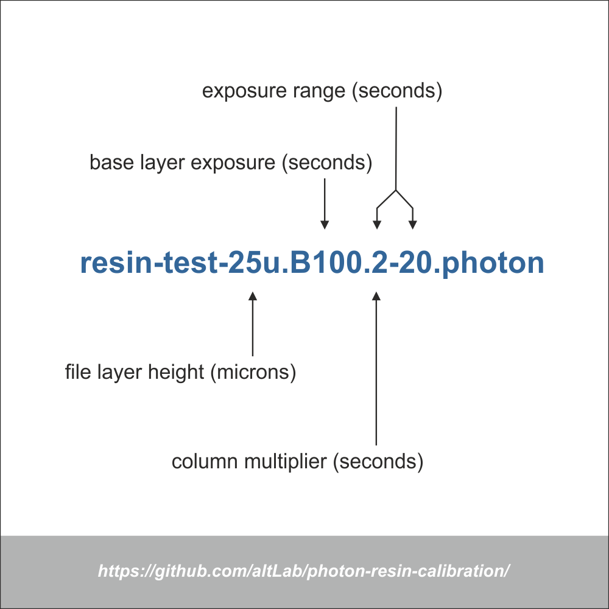

# mars-resin-calibration

### The Elegoo Mars Resin Calibration Tester (often called the Exposure Finder or XP Finder for short) 
is a method that allows you to quickly find the best exposure settings for any resin or UV film. 

Adapted from [Photon Resin Finder](https://github.com/altLab/photon-resin-calibration) to support Elegoo Mars running firmware 4.3.x.

This exposure range (latitude) tester removes most of the guesswork on layer time exposure by using multiple consecutive exposures to simulate different unique layer times for each test column. 

And it comes with the added bonus of learning all in one go, the minimum viable width for positive and negative space details of each column exposure time.

[How to use - by InventorSquare](https://youtu.be/4jYgyjmp6lo)

[How to use - Photonsters Youtube by Jay Sterling](https://www.youtube.com/watch?v=P5p4IgZuqMA)

----

### QUICK READ OF A CARD
- Start from top and locate first well formed circle column
- Move to bottom last visible Circle
- Move right untill the circle starts to clog
- Backtrack one colum
- That's your sweetspot

----

### Example Prints
Below is an example of validation models done from a 2-20s range card, revealing a usable range of 8-18s exposure time.

----

### Context Video
https://www.youtube.com/watch?v=0fksIkSthl8

The origins of this test come from a silkcreen and darkroom tuning technique called step wedge test, read about it [> here <](https://web.archive.org/web/20190409185035/https://medium.com/@spotprintsonline/step-wedge-test-a-high-quality-print-requires-a-good-stencils-cb1fbaa11998)

### Under The Hood
https://www.youtube.com/watch?v=s_NIeiNoKi0&t=73s

---

### Acknowledgements

Kudos to @Reonarudo for finding what makes .photon files tick. Check his project to convert images into .photon files (here)[https://github.com/Reonarudo/pcb2photon]

Kudos to Toby1kanobi in the anycubic owners forum for translating and cleaning up the gcode file used to switch modes in the printer

Kudos to dxxb for starting this transition to Mars and figuring out the g-code (here)[https://github.com/dxxb/photon-resin-calibration]

Kudos to toluse for figuring out how to hack the cbddlp files (here)[https://github.com/toluse/photon-resin-calibration]

---

You can find the source CAD Model that was used for this hack test [here](https://a360.co/2IDQpNy) and in the test_model directory.

