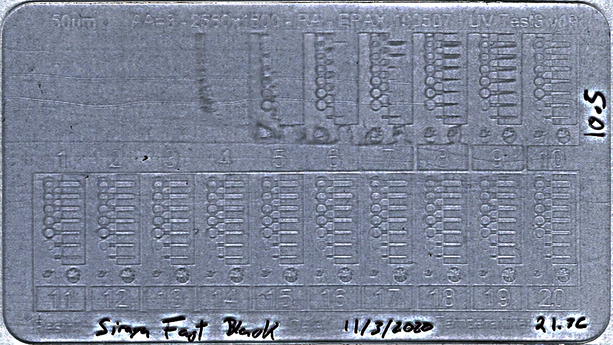

# ELEGOO Mars Resin Exposure Calibration

### The Elegoo Mars Resin Calibration Tester (often called the Exposure Finder or XP Finder for short) is a method that allows you to quickly find the best exposure settings for any resin. 

**TLDR:** Download the '[resin-xp-finder](resin-xp-finder/)' foler to a USB stick, read '[instructions.txt](resin-xp-finder/instructions.txt)' and enjoy.

**Credit:** Adapted from [Photon Resin Finder](https://github.com/altLab/photon-resin-calibration) to support Elegoo Mars running firmware 4.3.x.

This exposure range (latitude) tester removes most of the guesswork on layer time exposure by using multiple consecutive exposures on a single 7 minute print to implement different unique layer times for each test column. 
In a single print, you will discover the exposure sweet spot and the minimum viable width for positive and negative space details of each exposure time.

### Some useful videos about how to use this
[How to use - by InventorSquare](https://youtu.be/4jYgyjmp6lo)

[How to use - Photonsters Youtube by Jay Sterling](https://www.youtube.com/watch?v=P5p4IgZuqMA)

----
The following image is from the original Photon implementation describing the overall block structure. Use this to understand each part of the test block.

The following image is the actual Mars card implementation with exposures from 1 to 20 seconds in a single print. There are 3 base layer, each with 100 second exposure, and then the 20 * 1 second exposures. The total print time is about 7 mins (due to pauses of the Mars).

The following image shows the dimensions of all the features within a block test.

### QUICK READ OF A CARD
- Start from top left and locate first well formed block (the one where the negative and positive rectangles are well formed)
- Move to bottom last visible Circle
- Move right until the circle starts to clog
- Backtrack one colum
- That's your sweetspot

The following is from the original Photon tests for reference

The following image is from the Mars test printed in Siraya Tech Fast Black. This resin is somewhat transparent and therefore hard to image, but you can see the sweet spot is about 10.5 seconds.

----

### Example Prints
Below is an example of validation models done from a 2-20s range card, revealing a usable range of 8-18s exposure time.

----

### Context Video
https://www.youtube.com/watch?v=0fksIkSthl8

The origins of this test come from a silkcreen and darkroom tuning technique called step wedge test, read about it [> here <](https://web.archive.org/web/20190409185035/https://medium.com/@spotprintsonline/step-wedge-test-a-high-quality-print-requires-a-good-stencils-cb1fbaa11998)

### Under The Hood
https://www.youtube.com/watch?v=s_NIeiNoKi0&t=73s

---

### Acknowledgements

Kudos to @Reonarudo for finding what makes .photon files tick. Check his project to convert images into .photon files (here)[https://github.com/Reonarudo/pcb2photon]

Kudos to Toby1kanobi in the anycubic owners forum for translating and cleaning up the gcode file used to switch modes in the printer

Kudos to dxxb for starting this transition to Mars and figuring out the g-code (here)[https://github.com/dxxb/photon-resin-calibration]

Kudos to toluse for figuring out how to hack the cbddlp files (here)[https://github.com/toluse/photon-resin-calibration]

---

You can find the source CAD Model that was used for this hack test in the [test_model](test_model/) directory, and the instructions for reproducing the cbddlp files [here](010editor-template/README.md).

